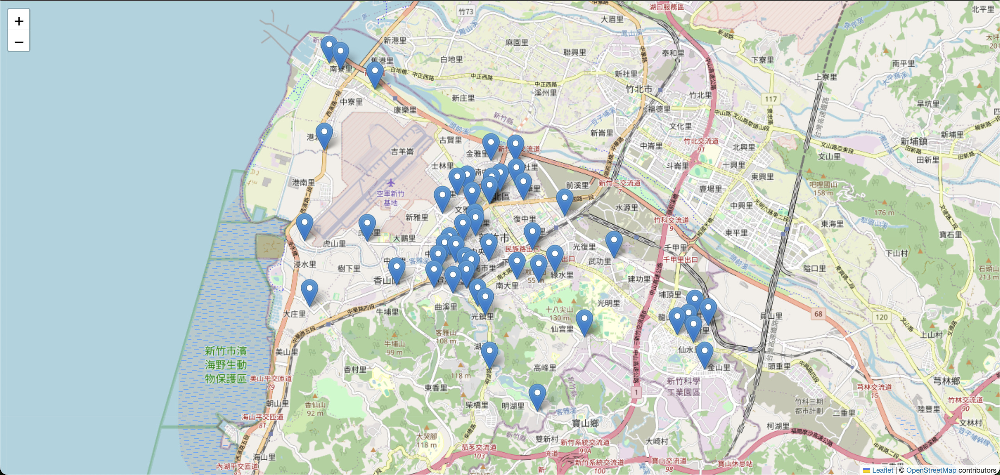

# 新竹市加水站地圖

發現自己整整三年都跑去更遠的加水站後直接破防，太生氣了所以弄了一個地圖，可縮放版本在[這裡](https://docs.zsl0621.cc/hsinchu-water-station)。



## 使用

1. 申請 Google API
2. 安裝和執行

```sh
git clone blog-script -q && cd blog-script/python/hsinchu-water-station
echo "GOOGLE_MAP_API=<your_api_key>" >> .env
uv sync
uv run water-map
```

不會有其他縣市的版本，因為 API 要錢而且每個縣市的格式都不一樣。
