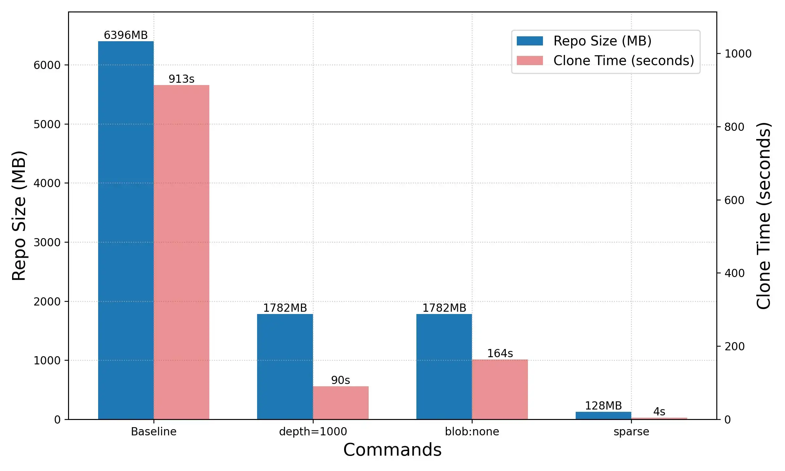

# 測試降低 git clone 容量的指令

並且以兩種典型 repo 進行測試：[超大型 repo](https://github.com/raspberrypi/linux) 和[放了圖片的 repo](https://github.com/xuejianxianzun/PixivBatchDownloader)，指令介紹的文章在我的[部落格](https://docs.zsl0621.cc/docs/git/advance/reduce-size-with-sparse-checkout)可以找到，測試結果如圖：

- 超大型 repo

- 放了圖片的 repo

